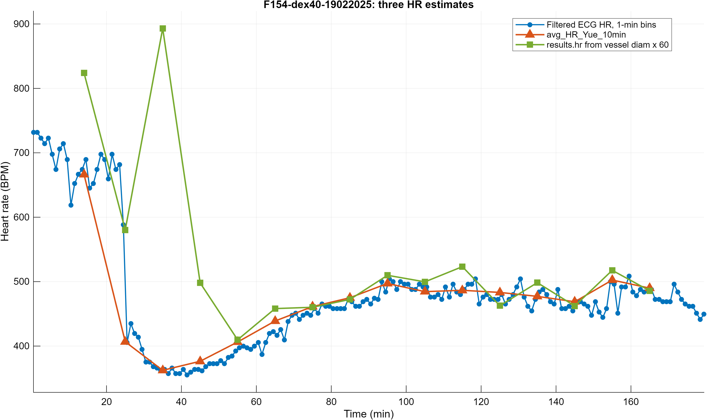
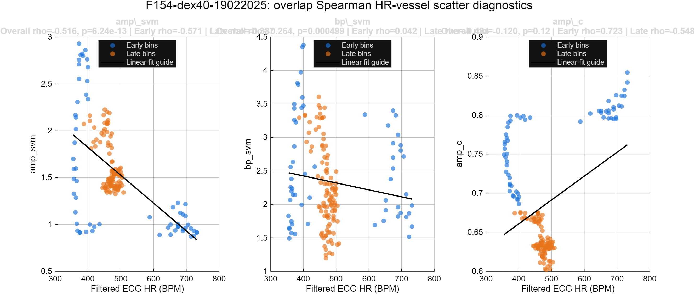
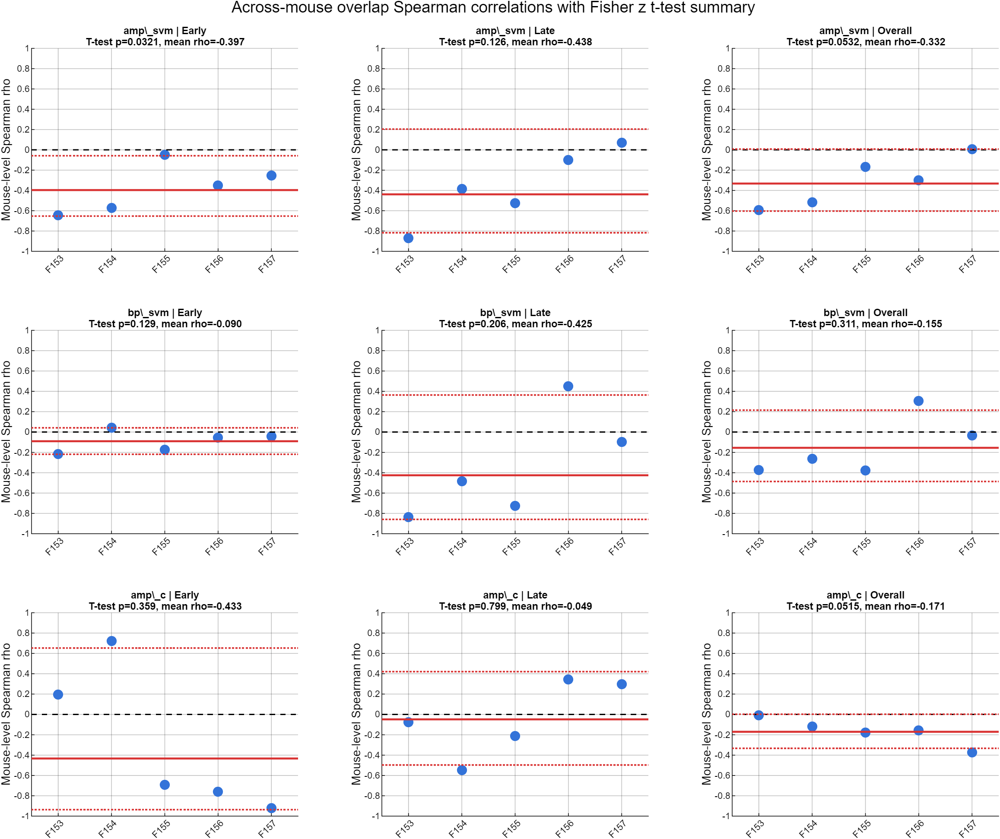
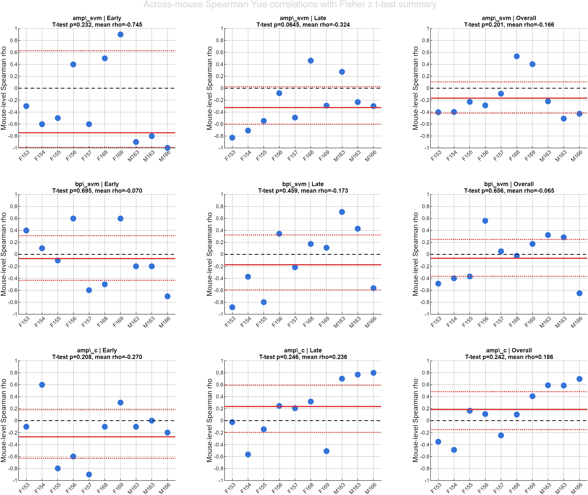

# Correlation Analysis of Heart Rate and Vessel Diameter Dynamics

## Quick Summary

### Aim

The aim of the analysis was to determine whether changes in heart rate were associated with changes in vessel diameter dynamics in the dex40 mice. We examined three features of diameter fluctuation: slow vasomotion amplitude, slow vasomotion power, and cardiac-frequency pulsation amplitude. Because ECG recordings can be noisy, we also compared three representations of heart rate to assess the reliability of the ECG-derived measurement used in the correlation analysis.

### Analysis

The primary analysis used quality-filtered one-minute ECG heart rate values paired with overlapping ten-minute vessel windows advanced in one-minute steps. Within each recording, Spearman correlations were calculated separately between heart rate and each vessel feature during the early period (before 60 minutes), late period (60 minutes or later), and full recording. The resulting correlation coefficients were summarized across mice, with the mouse retained as the unit of replication.

Heart rate was computed from an ECG-processing pipeline in which a machine-learning model identified R peaks and assigned each peak a confidence value between 0 and 1. We evaluated two methods for post-processing the same R peaks and confidence values. These methods differed in time-bin duration and in how low-quality periods or recordings were handled, but they were not independent measurements. A third estimate obtained from the cardiac-frequency peak in the vessel diameter spectrum provided a cross-modal comparison.

### Results

The sliding-window Spearman analysis produced an exploratory negative association between heart rate and slow vasomotion amplitude: mice generally tended to show smaller slow vessel oscillations when heart rate was higher. In the curated five-mouse cohort, the Fisher-transformed group test reached nominal significance during the early period (mean correlation approximately -0.40, p=0.032), while the overall result approached but did not reach the conventional threshold (mean correlation approximately -0.33, p=0.053). The corresponding Wilcoxon tests did not reach p<0.05. Slow vasomotion power and cardiac-frequency pulsation amplitude did not show stable group-level relationships with heart rate. Thus, the negative relationship with slow vasomotion amplitude should be treated as an exploratory signal rather than a definitive group effect.

The three heart rate representations generally followed similar temporal patterns. In particular, the two ECG summaries agreed strongly despite their different binning and quality-handling rules, and both showed broad agreement with the vessel-derived cardiac frequency. These comparisons support the technical reliability of the heart rate measurement, but they do not by themselves demonstrate biological coupling between heart rate and vessel dynamics.

## Heart Rate Estimation and Quality Control

Three heart rate estimates were compared for quality control: the quality-filtered one-minute ECG estimate used in the primary correlation analysis, an earlier ten-minute ECG estimate, and a cardiac-frequency estimate derived from vessel diameter. The purpose was to corroborate the overall heart rate trajectory, evaluate the consequences of different ECG quality-control choices, and identify recordings in which heart rate was uncertain. Only the vessel-derived estimate came from a separate measurement modality.

### Quality-Filtered One-Minute ECG Heart Rate

The first estimate was calculated directly from the ECG. Heart rate was calculated from the interval between consecutive detected R peaks and expressed in beats per minute. Values outside the physiologically plausible range of 250 to 750 beats per minute were treated as invalid.

ECG quality was evaluated separately in each one-minute interval. A minute was rejected when at least half of its candidate R peaks had low confidence. For accepted minutes, the median valid heart rate was retained. Rejected minutes remained missing and were not filled by interpolation or extrapolation. Recordings with extensive missing coverage could then be excluded from the correlation analysis rather than having their poor-quality periods reconstructed.

This more conservative representation was the only heart rate estimate used in the primary sliding-window correlation analysis. It retained one-minute temporal sampling while preventing low-confidence intervals from contributing artificial heart rate values.

### Ten-Minute ECG Heart Rate

The second estimate was the ECG heart rate summary produced by the earlier analysis workflow in ten-minute bins. It drew on the same R-peak detection and confidence assignments as the one-minute estimate and therefore was not an independent measurement. The two ECG estimates differed in bin duration and in the rules used to identify and handle low-quality periods or recordings.

The ten-minute ECG summary was retained as a corroborating calculation. Agreement between the one-minute and ten-minute ECG summaries tested whether the estimated heart rate trajectory was robust to those differences in binning and quality handling.

### Vessel-Derived Cardiac Frequency

The third comparison was the dominant cardiac-frequency peak in the vessel diameter power spectrum, converted from frequency to beats per minute. Unlike the two ECG summaries, this estimate was derived from the imaging signal. It therefore provided a cross-modal check that the cardiac rhythm identified in the ECG was also visible in vessel pulsation.

The vessel-derived estimate was used for heart rate validation only. It was not used as the heart rate measurement in the main heart rate-vessel correlation analysis because it is itself calculated from the vessel signal and would not constitute an independent predictor of vessel behavior.

Agreement among the three representations was examined within each recording. The comparison established whether they followed the same broad temporal pattern and helped identify recordings in which the estimates diverged enough to raise concern about signal quality. Agreement was interpreted as evidence about heart rate measurement reliability, not as evidence that heart rate controlled or was coupled to vessel diameter dynamics.

## Vessel Diameter Processing

The vessel diameter trace was aligned to the ECG time base using the recorded timing offset between the imaging and physiological acquisition systems. Diameter measurements were converted from pixels to micrometers before feature calculation.

Slow drift in baseline vessel diameter was removed by subtracting a ten-minute moving average from the original diameter trace. This step preserved fluctuations occurring on shorter time scales while reducing the influence of gradual changes in imaging position, vessel baseline, or recording conditions.

Three frequency-based vessel features were emphasized:

1. **Slow vasomotion amplitude.** The detrended diameter signal was filtered to retain slow fluctuations up to 0.3 Hz. The amplitude of these fluctuations within each analysis window was summarized by their interquartile range. This provided a robust estimate of the size of slow vessel oscillations.

2. **Slow vasomotion power.** The power spectrum of the detrended diameter signal was estimated within each analysis window. Spectral power was integrated from 0.01 to 0.3 Hz, providing a complementary measure of the strength of slow vasomotor activity.

3. **Cardiac-frequency vessel pulsation amplitude.** The detrended diameter signal was filtered within the cardiac range used for the dexmedetomidine recordings, 3.5 to 15 Hz. The interquartile range of the filtered signal was used to quantify the amplitude of vessel pulsation associated with the cardiac cycle.

## Time-Window Definitions

The analysis summarized vessel features in ten-minute windows advanced in one-minute steps, beginning at recording time zero. Within each window, slow vasomotion amplitude, slow vasomotion power, and cardiac-frequency pulsation amplitude were computed and paired with heart rate.

The ten-minute window provided more data for estimating low-frequency vessel activity, particularly spectral power in the slow vasomotion band. The resulting windows overlapped substantially, producing a smoothly sampled description of how vessel dynamics changed over time.

Each ten-minute vessel window was paired with the quality-filtered one-minute ECG heart rate value at the start of that window. Correlations used only matched observations with finite heart rate and vessel-feature values. Because this pairing uses heart rate at the window start rather than heart rate averaged across the full ten-minute vessel window, it should be described explicitly when the analysis is reported.

Correlations were evaluated over three recording periods:

- **Early:** times before 60 minutes.
- **Late:** times at or after 60 minutes.
- **Overall:** all available matched time points.

The early and late divisions were used to test whether heart rate-vessel relationships changed over the course of the recording rather than assuming that one relationship remained constant throughout the experiment.

## Within-Mouse Correlation Analysis

For each mouse, heart rate was correlated separately with each vessel feature across the matched time windows. Missing or rejected observations were removed pairwise, so a correlation used only time windows in which both heart rate and the vessel feature were available.

Spearman rank correlation was used throughout the primary analysis. This approach tests whether heart rate and a vessel feature changed together in a consistent monotonic direction without requiring their relationship to be linear or the measurements to be normally distributed. It is also less sensitive to extreme values that may remain after physiological signal processing.

The analyses produced one correlation coefficient for each mouse, vessel feature, and recording period. A positive coefficient indicated that the vessel feature tended to increase as heart rate increased. A negative coefficient indicated that the vessel feature tended to decrease as heart rate increased. The magnitude of the coefficient described the strength of the within-recording association.

## Recording-Level Quality Review

The quality-filtered overlap analysis required adequate ECG coverage. Recordings with extensive missing heart rate values could not provide a stable estimate of association and were excluded when more than half of the aligned heart rate observations were unavailable.

The diagnostic comparison of heart rate representations also identified recordings with substantial disagreement among the estimates. Six recordings were excluded from the final curated Spearman overlap analysis on this basis, leaving five recordings with the clearest agreement among heart rate measurements. Because this exclusion was informed by diagnostic review, the curated analysis should be presented together with the broader, less restrictive analyses as a sensitivity comparison rather than as the only view of the data.

## Group-Level Statistical Analysis

The mouse, rather than the individual time window, was used as the unit of inference. Time windows within a recording are repeated and strongly overlapping observations from the same animal; pooling them across animals would therefore overstate the effective sample size.

For each vessel feature and recording period, the distribution of mouse-level correlation coefficients was evaluated in two complementary ways. A Wilcoxon signed-rank test assessed whether the median correlation across mice differed from zero without assuming a normally distributed set of coefficients. A one-sample test was also performed after applying the Fisher transformation to the correlation coefficients. The transformed values were tested against zero, and the group mean and confidence interval were converted back to the correlation scale for presentation.

Group summary plots show one point per mouse, a group mean correlation, a 95% confidence interval, and a reference line at zero. This format displays both the average direction of the association and the degree of consistency or heterogeneity across animals.

The current analyses tested several vessel features across early, late, and overall periods. The resulting probability values were not adjusted for the number of comparisons. The correlation findings should therefore be described as exploratory unless a multiple-comparison strategy is selected before the final manuscript analysis.

## Comparison With the Older Non-Sliding Analysis

An earlier analysis used non-overlapping ten-minute bins and the older ten-minute ECG heart rate estimate. This analysis was not directly equivalent to the primary sliding-window analysis because it used a different heart rate summary, a larger cohort, and substantially fewer observations per recording.

Nevertheless, its broad conclusion was similar. None of the three vessel features showed a statistically significant group-level Spearman correlation with heart rate during the early, late, or overall period. The closest result was a negative late-period association between heart rate and slow vasomotion amplitude (mean correlation approximately -0.32; Fisher-transformed group test p=0.064; Wilcoxon p=0.064). This is directionally consistent with the negative slow-vasomotion-amplitude relationship observed in the sliding analysis, but it did not cross the conventional significance threshold. The other vessel features showed no stable association in either analysis.

## Figures

**Figure 1. Representative heart rate quality-control comparison.** The quality-filtered one-minute ECG estimate, related ten-minute ECG estimate, and vessel-derived cardiac frequency are overlaid for an example recording. The two ECG estimates share the same underlying R-peak confidence pipeline; the vessel-derived estimate provides the cross-modal comparison.

**Figure 2. Representative within-mouse sliding-window correlations.** Quality-filtered one-minute ECG heart rate is plotted against each of the three features calculated from overlapping ten-minute vessel windows. Early and late observations are shown separately.

**Figure 3. Primary sliding-window group summary.** Each point represents one mouse's Spearman correlation. Solid red lines show the Fisher-transformed group mean after conversion back to correlation units, dotted red lines show the 95% confidence interval, and the dashed black line marks zero correlation.

**Supplementary Figure 1. Older non-sliding ten-minute analysis.** This analysis used the older ten-minute ECG heart rate estimate. It showed no significant group-level correlation for any of the three vessel features, although the late-period slow-vasomotion-amplitude result showed a similar negative direction to the primary sliding analysis.

## Scope and Interpretation

This write-up presents the current sliding-window implementation: quality-filtered one-minute ECG heart rate at each window start, overlapping ten-minute vessel windows advanced in one-minute steps, and Spearman correlation. Alternative temporal matching and Pearson correlation are outside the present scope.

The displayed group analysis contains the five recordings with the clearest agreement among heart rate estimates. The findings therefore describe this quality-curated subgroup rather than the full set of dex40 recordings. In addition, probability values were not adjusted across the three vessel features and three recording periods. For these reasons, the negative relationship between heart rate and slow vasomotion amplitude should remain explicitly labeled as exploratory.
